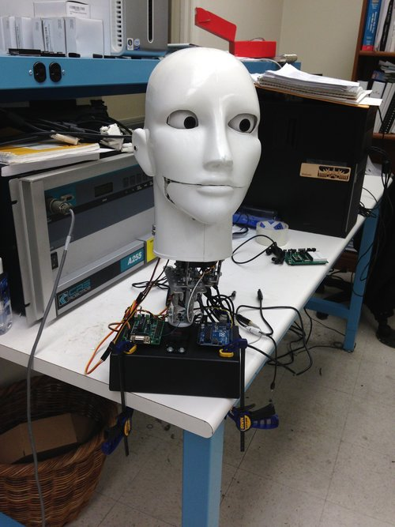
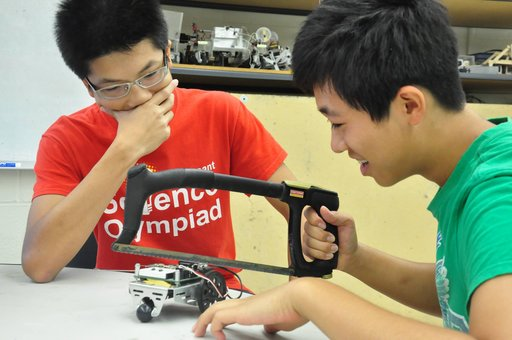

 
<small><i>CAESAR, an android head that would use the two cameras in its eyes to find and face you</i></small>

 
 
In the summer of 2013, between my junior and senior year, my friend [Genji](http://genjinoguchi.github.io/) and I conducted research in the [Mechatronics Lab](http://mechatronics.poly.edu/) in New York University. We helped to upgrade their robotic arms by installing potentiometers onto the servo motors of their robots. With the use of an Arduino Uno, we used a P.I.D. (Proportional Integral Derivative) controller in order to account for the error between the desired angles set for the servo motors and the actual angles of the servo motors. A PID controller calculates an error value as the difference between a measured process variable and a desired setpoint. The controller attempts to minimize the error by adjusting the process through use of a manipulated variable, which in this case is a PWM function in an Arduino.  

We also contributed to CAESAR, an android head that would swivel to face you with the help of face-recognition technology.  

 
<small><i>Our professor asked the lab for photos of students working hard on some robot for a presentation. We came up with this</i></small>

 
 
View the Arduino source code used to calibrate the robotic arms [here](https://github.com/devChuk/Mechatronics-Arduino-Code).

Check out our Solidworks CAD files [here](https://drive.google.com/folderview?id=0B_RTwatU12PgZzY4Y1JHUEE5TkE&usp=sharing).