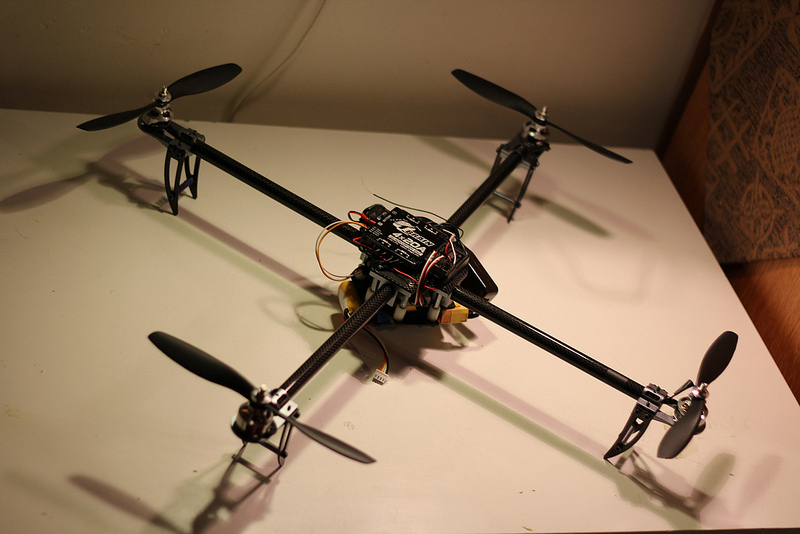

 
 
After the robot arm project, a friend and I started the quadcopter project. The many uses and abilities of UAVs fascinated me so I decided to try to understand them by building one from scratch.

We used a carbon fiber frame, an Arduino Mega microcontroller, a Q Brain Quadruple ESC, four brushless motors, a battery, a gyroscope, magnetometer, and accelerometer in order to create our quadcopter.
 
 

<iframe width="640" height="480" src="//www.youtube.com/embed/ggZWCVDdSWQ?rel=0" frameborder="0" allowfullscreen></iframe>

<small><i>Unfortunately we don't have any footage of it flying. However, here's a video of me flying [Patrick](http://www.patosai.com/)'s quadcopter.</i></small>

 
 
More project details are located [here](http://naokicho.com/#quadcopter).