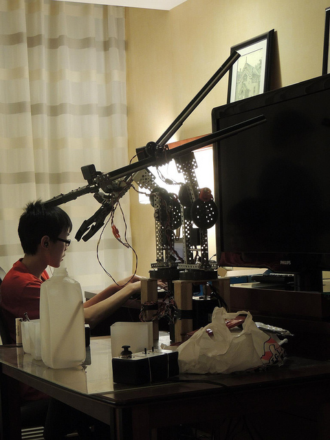
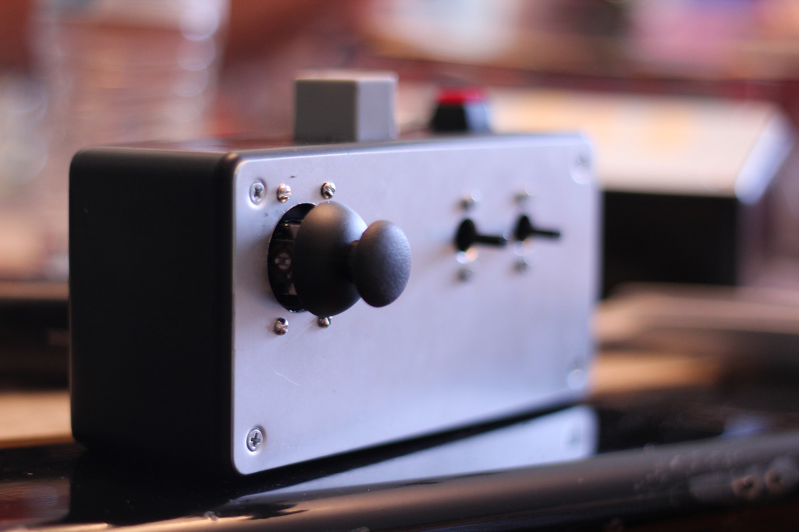

 
<small><i>The Robot Arms 2013</i></small>

 
The Robot Arm is a device I built with teammates in high school for Science Olympiad competitions, where it placed 8th place at both the regional and state level. It features two robotic arms and two control boxes with Ethernet cable detachability for each driver. The arms were also equipped with potentiometers for autonomous operation.
 
 

<object type="application/x-shockwave-flash" width="800" height="450" data="https://www.flickr.com/apps/video/stewart.swf" classid="clsid:D27CDB6E-AE6D-11cf-96B8-444553540000"><param name="flashvars" value="intl_lang=en-US&photo_secret=037e94cdaf&photo_id=9670597738&hd_default=false"></param><param name="movie" value="https://www.flickr.com/apps/video/stewart.swf"></param><param name="bgcolor" value="#000000"></param><param name="allowFullScreen" value="true"></param><embed type="application/x-shockwave-flash" src="https://www.flickr.com/apps/video/stewart.swf" bgcolor="#000000" allowfullscreen="true" flashvars="intl_lang=en-US&photo_secret=037e94cdaf&photo_id=9670597738&hd_default=false" width="800" height="450"></embed></object> 
<small><i>An autonomous run of one arm</i></small>

 
 
The arms were mainly built with VEX parts and an Arduino. We combined electric motors and a potentiometer to create our own servo motors.
 
 

<iframe width="640" height="480" src="//www.youtube.com/embed/OIwOl7U1lhg?rel=0" frameborder="0" allowfullscreen></iframe> 
<small><i>Practicing the night before the competition</i></small>

 
 
Working on the robot arms were the most fun and influential times I've had during high school. If it weren't for the event leader of the event, [Naoki Cho](http://naokicho.com/), I would not have been so interested in Electrical Engineering and Mechatronics or be able to use the Arduino.
 
 

 
<small><i>The control box of the robot arm</i></small>

 
 
You can learn more about the project [here](http://naokicho.com/#robot-arm).