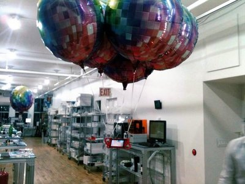
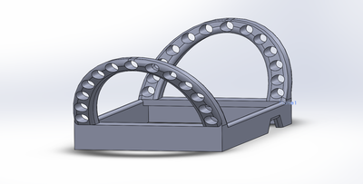
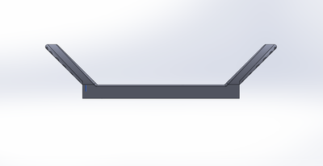
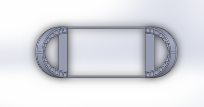
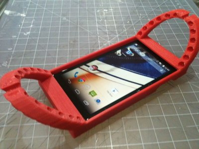
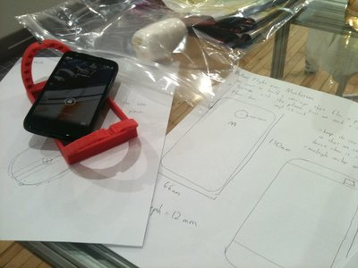
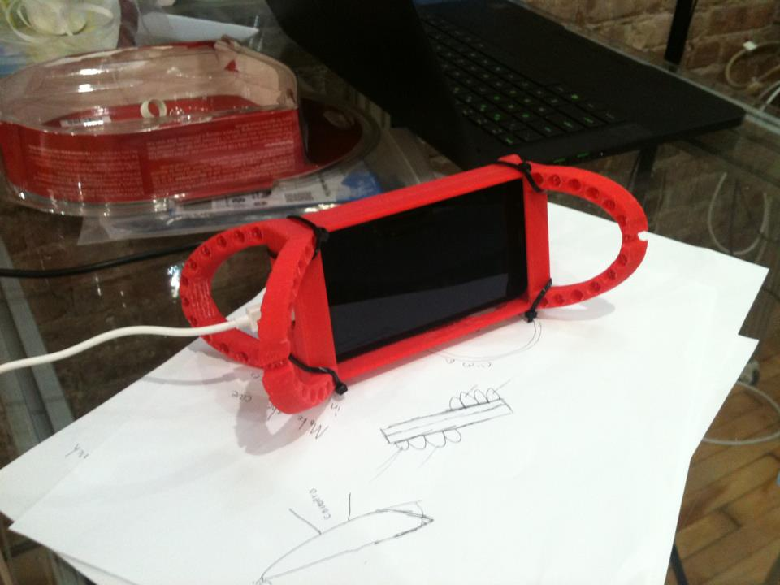
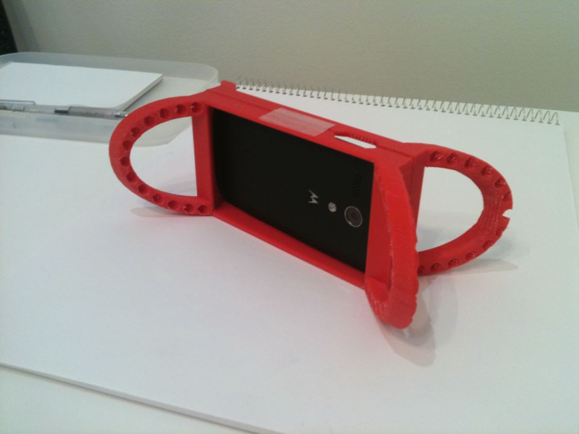
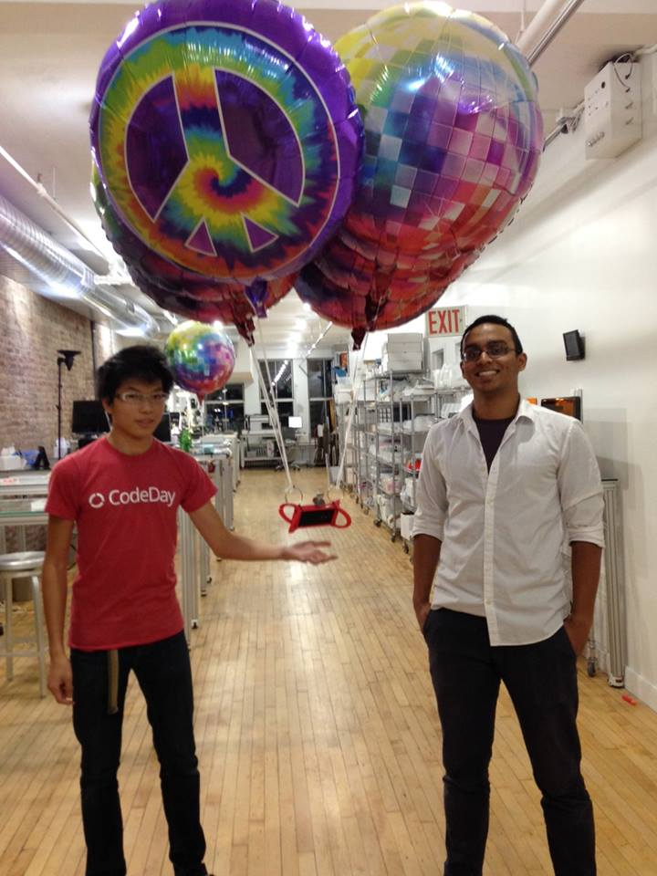

 
<small><i>Just floating there</i></small>
  

On the day after I got home from [BattleHacks Boston](https://2014.battlehack.org/boston) where we built [Lineless](http://devchuk.github.io/portfolio/software/lineless.html), my friend Yaseen asked me if I happened to be free for the rest of the week.
  
It turns out that the company he interned in, [Kite & Rocket](http://kiteandrocket.com/), needed some help designing & building a balloon carriage to launch a phone up in midtown Manhattan. The goal was to broadcast a [livestream](http://www.ustream.tv/channel/kite-and-rocket) running from the phone's camera by the end of this week. What's even more ridiculous about this thing is that I would actually be paid for this. So I said something alone the lines of "..yes of course" and the project started right away on the same day.
  
For the project, we used:

>		cable ties
>		ribbons
>		a helium tank
>		6 foil balloons
>		a couple book/binder rings
>		a Verizon Wireless Prepaid Motorola Moto G No-Contract Cell Phone
>		a 500 MB data plan with unlimited texting and stuff I don't remember
>		a 3D printer & CAD software

  
So once I bought the phone, I measured its dimensions and began to design the case with Solidworks CAD software. It was made in two parts that are mirror images of each other.
 
 

 
<small><i>Isometric view</i></small>

 
 

		 
<small><i>The side view & the top view</i></small>

 
 
The case features holes for the lock button, the volume buttons, the charger port, and the microphone hole. Basically, you were able to use the phone normally with the case on. Also, the case had a roll cage that would cause the phone to roll onto its side no matter what happens, thus enabling us to capture footage once it <del>crashed</del> landed. The roll cage also doubled as an attachment point for balloon ribbons and any ballasts we needed. I decided to add as many holes as possible so we could choose what angle we wanted the phone to be set at for the camera angle.
 
 

		 
<small><i>Fitting like a glove & the plans</i></small>

 
 
Unfortunately the Makerbot 3D printer stopped printing the first half of the case due to an SD card error, but only the very middle hole of the arc roll cages was unusable. We didn't plan to use it anyways because we wanted the phone to aim at around a 45 degree angle instead of straight down.
 
 

		 
<small><i>Most important: it's red</i></small>

 
 
I continued by printing with the second half of the case and assembled the case using cable ties with the phone inside. Then I looped binder rings onto both sides of the device and tied three balloons to each binder ring. This way we're able to remove the binder rings and safely carry the balloons seperately from the case in case of any sharp obstactles. More cable ties were used to secure the balloons to the binder rings.
 
 

 
<small><i>It's flying!</i></small>

 
 
We didn't want the balloon camera to just fly straight up and get above the NYC skyscrapers. Instead we wanted it to slowly crawl up in order to see people's dumbfounded faces. Thus, I used a lathe to carve a "unicorn horn" out of ABS and glued it to the top of the case. Washers were stacked around the unicorn horn in order to weigh it down. In the end, the weight of the apparatus was so neutral that it would just stay at exactly the same level, only changing in position by my mere breathing.
 
 

 
<small><i>Ready to launch</i></small>

 
 

<iframe width="939" height="528" src="//www.youtube.com/embed/QpypTcLjnKs?rel=0" frameborder="0" allowfullscreen></iframe> 
<small><i>Neutrally buoyant</i></small>

 
 
THEN ADD VIDEO OF FLIGHT
  
I had so much fun working on this and the day of the balloon launch is definitely one of the more exciting days of my summer. There were so many close calls with street lamps and buildings on the balloon that we were all cheering and yelling as we watched its livestream. We also even caught footage of a flying helicopter under us. The apparatus ended up streaming for 2.5 whole hours, visiting:
>		39th and 5th
>		next to the Chrysler building
>		Roosevelt Island
>		Long Island City
>		Mt. Zion Cemetary
>		Jackson Pond Playground at Forest Park
>		Plumb Beach Channel
>		Middle Bay
>		North Meadow Island Bridge
>		Jones Beach State Park
>		Nikon at Jones Beach Theatre
>		The Atlantic Ocean

  
So what is there to take away from this project?

Well first of all,  

<b>Keep it simple.</b>

The balloon phone flight shows that you don't need an expensive and complicated [quadcopter](http://devchuk.github.io/portfolio/hardware/quadcopter.html) to get the footage you want. Since the helium does all the work in keeping the aircraft in the air, we can focus more power into adding fans and making this controllable. The only issue is that we can't use phones to replace microcontrollers like the Arduino as of right now. Maybe I'll look into that in the future..
  
<b>Only when you're risking something-taking on a challenge-are you actually living.</b>

I was talking about this to Rob, an inventor and the founder of Kite & Rocket. We were talking about this time we launched a giant rubber balloon filled with air onto the street at 11 pm one night and how we cringed every time it was so close to exploding. He said something about how emotional stress makes you feel a lot more alive. And in a way, the statement is somewhat true. Everyone who was helping in the balloon launch was just so full of life as we rose above the New York City skyline, soared over a helicopter, and received incredible footage from deep in Long Island. It's eustress-the feeling you get when you're on a rollercoaster. When you're scared to death but somehow more alive than ever.
  
However, I reworded the statement to the bold sentence above because what Rob said might have taken a masochistic approach haha.
  
Well that's all for now. Thanks for reading this project page! There will be more to come. :)
  
Download the solidworks or STL files [here](https://drive.google.com/folderview?id=0B_RTwatU12PgR2NjdXJ6UDdBODQ&usp=sharing).

Older solidworks files are found [here](https://drive.google.com/folderview?id=0B_RTwatU12PgY2I3NWpZN1B4NDQ&usp=sharing).

More [photos](https://drive.google.com/folderview?id=0B_RTwatU12PgZi15UUJXdmJuUHc&usp=sharing) and [screenshots](https://drive.google.com/folderview?id=0B_RTwatU12PgdHMzeFdvX2R5Skk&usp=sharing)
