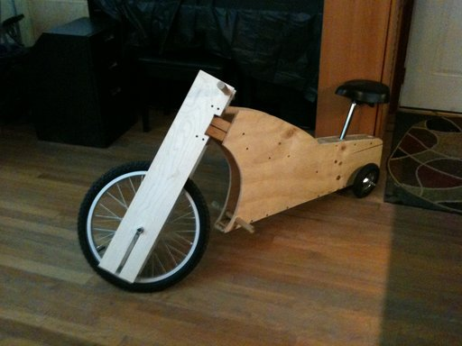

 
<small><i>The Wooden Trike</i></small>
 
This is probably one of the most fun and ridiculous projects I've had yet. Stuyvesant High School has a woodshop class on the 10th floor. For our final project, we're allowed to build anything we want. Usually students would build shelves, chairs, desks, or other small furniture&#8210;but I wanted to have a little fun.
 
 

 
<small><i>The frame was contstructed with 2x4's in order to have empty spaces for storage. Note the fully wooden axle for steering.</i></small>

 
So in one night on a coffee table in my living room, I built a wooden bike from complete scratch.
 
 

		 
<small><i>Riding the trike in Penn Station and the Tribeca Bridge</i></small>

 
The large 20" diameter front wheel and two smaller back wheels were bought for around only $30 at a bike shop. The bike seat was taken from an unused exercise bike, and all the wood is completely scrap wood. In other words, building this bike costed less than $40. I did not want to go through the pain of adding a pedaling system, so in order to move you simply kick onto the ground like how you would ride a scooter.
 
 

 
<small><i>Allen flying down a hill</i></small>
 
Another really fun part about this project was how people reacted to the trike. It was so light that it was able to be easily carried up and down staircases, so I rode this trike around in the hallways to get to my classes. In public, people would ask to take a photo of the trike or even have a go riding it too. When Allen and I were taking turns riding it down a hill, two women in their 20's walked up to us and asked us for permission to ride it down the hill too.
 
 

 
<small><i>Ready to roll</i></small>
 
I would love to come back to this project and improve it by creating an electric wooden motorbike. In fact, I already have the design for an electrike wooden motorbike that carries two people. Unfortunately as of now I do not have the funds to buy all the electric parts and strong, light wood required to make an vehicle that would be usable for real transportation. We'll see what happens in the future.