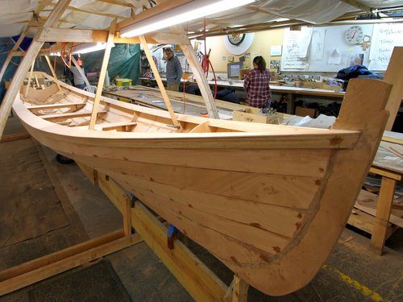
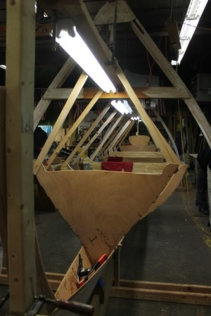
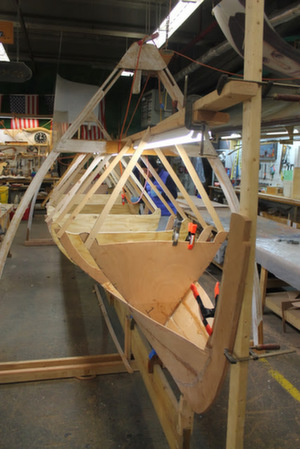
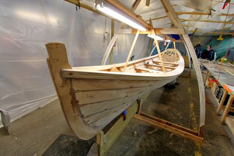
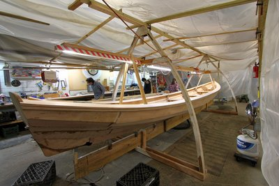

 
<small><i>The Whitehall Gig</i></small>
 
As a coxswain of Stuy Crew in the [Village Community Boathouse](http://www.villagecommunityboathouse.org/), sometimes we help out in building boats in the woodshop on Pier 40.  

		 
<small><i>The frame</i></small>

 
We started out with the ribs of the boat during very cold January days and wrapped them with planks. Epoxy resin (we called it peanut butter because it really did look like peanut butter) was applied on both the inside and outside of the boat in order to prevent leakage. 

The planks were finished off with gunwales, and the rest of the parts of the boat were added.
  

		 
<small><i>The bow & the starboard of the boat</i></small>

 