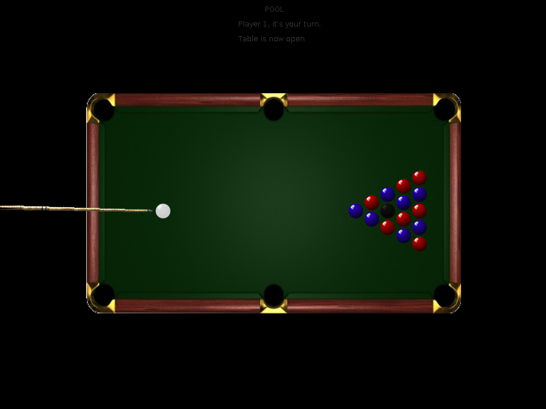

<small><i>The Pool Break Shot</i></small>

 

Pool.java is a game I made with [Patrick](http://www.patosai.com/) during the second [Codeday Hackathon](http://codeday.org/ny) of 2014. It features a physics engine in Java to simulate the reflections and movements of billiards balls and algorithms that follow billiard rules and determine the winner.
  
View the source code and play the game [here](https://github.com/devChuk/HackCODEDAY_NY).