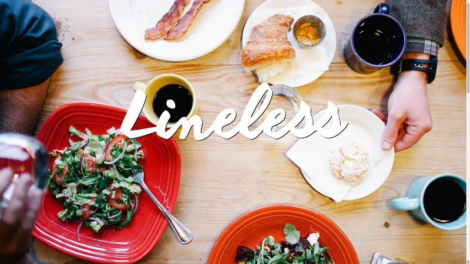
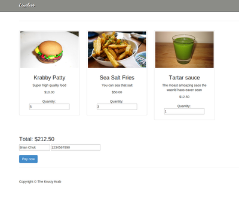

 
<small><i>The Lineless landing page</i></small>
  

Lineless was a submission to the [Battlehacks Boston hackathon](https://2014.battlehack.org/). It's a web app built with [Firebase](https://www.firebase.com/), [NodeJS](http://nodejs.org/), and [AngularJS](https://angularjs.org/) to remove waiting in restaurants and delicatessens. The way it works is by having users order the food (and pay for it with the [Venmo API](https://venmo.com/)) they want before they enter the restaurant. When the restaurant is done making the food, the user would be notified via the [Twilio](https://www.twilio.com/) API. Other things I'd like to give credit to are [Font Awesome](http://fortawesome.github.io/Font-Awesome/) for the icons in the landing page and [Death To The Stock Photo](http://deathtothestockphoto.com/) for the beautiful & free photos.

 

<small><i>An example menu page of a restaurant. Note how the total autoupdates as you add more to your order.</i></small>

  

Check out the landing page [here](http://lineless.github.io)

Look at our source code in this [link](http://github.com/Lineless)