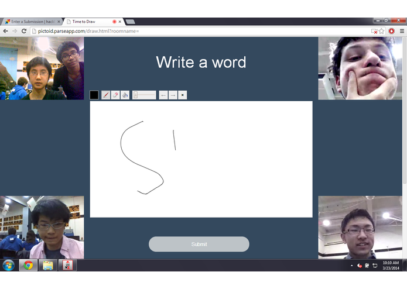
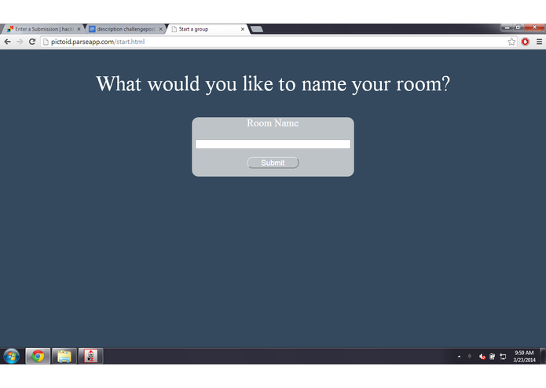
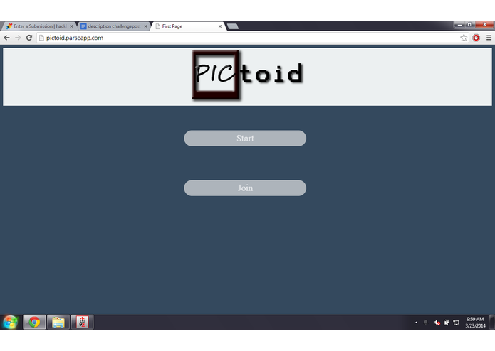

<small><i>What is that?</i></small>

 

On [HackBCA](http://hackbca.com/) I teamed up with four other high school students to build a pictionary telephone web game called Pictoid. The game requires four or more players to enter the same room.

 

<small><i>Create a room here</i></small>

  

Then each player will be given a blank canvas to write any word they want. After each player has submitted a word, the words are then sent to the next player in line. To illustrate in a situation with four players, player 1 would send a word to player 2. Player 2 would send a word to player 3. Player 3 would send a word to player 4. Then player 4 would send a word to player 1.
  
Basically each player will create a word and receive a word.
  
After the words are sent around, each player must draw a picture to represent that word within a ridiculously short time limit. Then the pictures are sent around. The players then must try to guess a word that represents the drawings they receive. Next, those words the players guessed would be sent around and the players much now draw another picture to represent the words they receive.
  
Over time, the ideas conveyed through the words and pictures will mutate into other ideas. When the number of passes reaches a set point, the game ends and the players would be able to see how their ideas evolved as they were passed around. What makes the game so fun is that there is video chat support with the help of [TokBox](https://tokbox.com/) so players can see each others' facial expressions and yell at one another for silly errors like mistaking a drawing meant to represent water as fire.
 

<small><i>Create your own room or join an existing one</i></small>

 
You can view the source code [here](https://github.com/devChuk/HackBCA_CSTUY).
