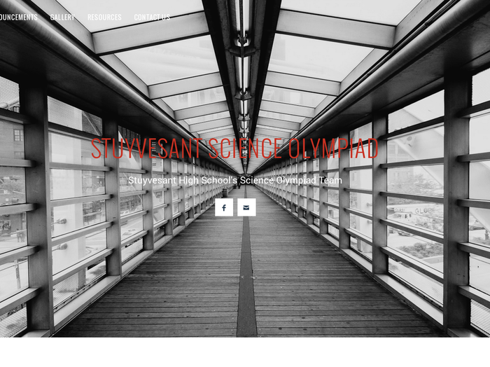

<small><i>The home page</i></small>

 

As president of Stuyvesant Science Olympiad, I wanted to create a website for my club as a final parting gift as I graduated. It features a blog made with [Jekyll](http://jekyllrb.com/), a gallery created with [JQuery](http://jquery.com/) (programmed by [Genji](http://genjinoguchi.github.io/)), and a contact page as well as an about page.
  
Visit Stuyvesant Science Olympiad's official website [here](http://stuyscioly.github.io/).

View our source code [here](https://github.com/StuySciOly/StuySciOly.github.io).