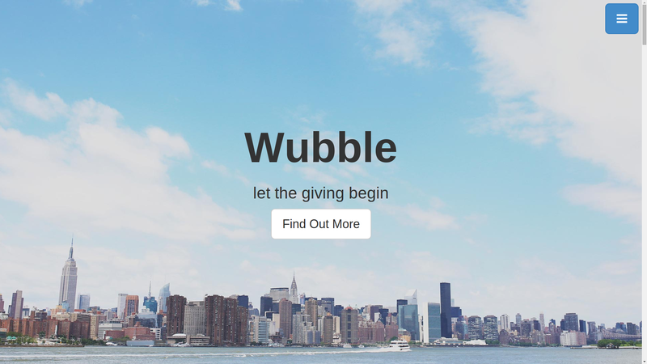

 
<small><i>The Wubble page</i></small>

 
 
Wubble is the first web actual web page I've made with HTML, CSS, and javascript. It was for a high school economics group project where we had to introduce a business idea to the class.  

View the website [here](http://devchuk.github.io/Wubble/)

View the source code [here](http://github.com/devchuk/Wubble).
