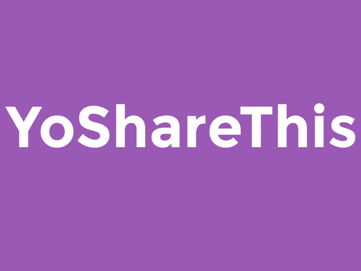

<small><i>YoShareThis!</i></small>

 

I created YoShareThis using the Yo API during [YoHackEAST](https://www.eventbrite.com/e/yo-hackathon-nyc-2-letters-2-hours-ready-set-yo-tickets-12145608843). It's a heroku app that allows an user to send a Yo whenever they hear music they like. When a Yo is sent, the server will send an embed Yo to all the user's friends that links to a Youtube video of the music.
  
Basically, it's a share button for real life.
  
View the source code [here](https://github.com/devChuk/YOSHARETHIS).